# marketAnalysis-LiquorStores

Iowa Liquor Store Business Analysis and Location Selection  
Video link: https://www.dropbox.com/s/9b0d4uolzlwckp6/SU-finalP.mp4?dl=0  
Steve Su  
CSCI 3287  
12/9/2019  

Introduction:  
The concrete objective of this study is to find profitable areas to open up a liquor store in Iowa City.  Determination was done solely through use of public data bases.  Although the study was hypothetical, another major goal of this study was to discover a computational process by selecting and using appropriate tools to answer the question above.  After a process has been established, the methodology can be extrapolated to answer future inquiries.    
To start this process I used several data bases available on Google’s Big Query application.  These included, Iowa Department of Commerce liquor sales data base and US census geographic and demographic related data bases .   Google’s Big query provides a nice interface to pull in these large data sets.  

The basic procedure was to perform queries and generate tables which focused on statistics of the overall liquor store business in Iowa City.  For example, statistics such as population growth and number of stores over the last five years were examined.  The next level was to drill down to store level sales data and neighborhood demographics.  Lastly, selection of a store location was performed.  This involved postGIS using postgreSQL in Google’s Cloud SQL application.  Graphics were produced using various Python libraries such as Matplotlib and Geopandas.  To make the process more seamless between using Jupyter Notebook and Google Cloud Platform, SQLalchemy was used.  This allowed for some tasks to be automated by creating functions to retrieve data from Google Cloud and plot the results automatically in Jupyter Notebook.  

Public Databases Used:  
The main data bases used in this study were directly available using Google’s big query tool.  These included 1) Iowa liquor sales, 2) US census population statistics by tract (2012 -2016) , 3)  US census geographical tract data.  The Iowa liquor sales database contained sales for bottled spirits, meaning no beer and wine, nonetheless it should provide valuable information of overall alcohol sales.  Each tuple in the data base is a sale from the Iowa alcohol commission to an individual store.  Things such as store name, address, GPS coordinates, sales in dollars, bottles sold, product name, invoice_id (primary key) were included.  I was able to collect data from the years 2012 to 2016.  However some of 2016 was incomplete.  The size of the database was over 4 GBs.  The other data bases used were the US census population tract statistics.  There was one for each year from 2012 to 2016.  In total the 5 databases were just over 0.5 GBs.  These databases were helpful to find things like employment characteristics and population of persons over 25 for a given census tract.  I later found out that a tract has finer resolution than breakdown than zip codes.  A tract is designed to represent a neighborhood of approximately 4000 persons.   A geo_id is a unique identifier for a given neighborhood.  I used this make comparisons between different neighborhoods.  Lastly, I was able to use US census geographical tract data for geo comparisons using postgreSQL queries.  

Table Creation:  
To get an overview of the liquor business in Iowa City I performed an aggregate analysis of historical statistics on, sales, adult population, number of stores, and store locations for a given year.  To create these tables I used the main Iowa liquor data base and performed many union all joins filtering by year grouping by store_name and performing aggregate operations.  This gave me a table that I could reference to by store name.  I called this the sales table.  To get a table broken down by yearly statistics I used census data and combined data bases for the years 2012-2015 and searched for the adult population (over 25years) summing over all tracts in Iowa city as defined by their geo_id.  I called this table, pop25over.  By using the sales and pop25over tables I created a table called IowaAggregate where I combined columns of both tables and also created new columns such as persons to store ratio, persons to sales ratio.  This table was helpful to identify some key metrics at a city level.  

To perform census queries of each liquor store to its census tract I used postgreSQL to create a table called liquorStoreTract which related each liquor store to its geo_id census tract.  I was able to determine each store’s geo_id by seeing if its Point intersected with the census’ tract Polygon.  Now I was able to create a table which related a liquor store to its census demographics data.  I called this table empByLiqStoreTract because I used employment data.  For this table I just used latest data available, year 2016.  Each of these tables are shown below in the entity relationship diagram through the use of MySQL Workbench.  

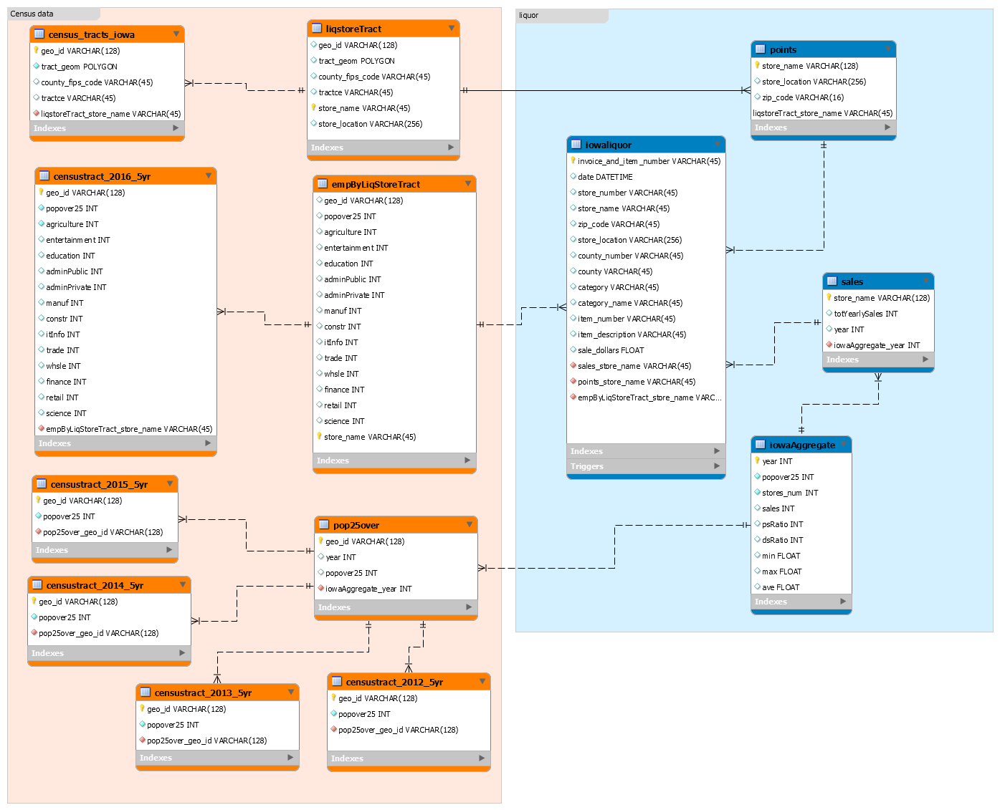  
Fig. 1  Entity Relation (ER) diagram  

Details of Code and Tools Used:  
Most of the analysis was accomplished through Google’s Big Query and Cloud SQL.  The majority of the queries where done using the Big Query.  Big Query is the portal to Google’s public data bases.  Some nice features of BigQuery is that it saves all queries so you can go back and re-examine what you did.  Also tables can be saved as a csv file or saved along side the public data bases.  Both SQL and postgreSQL commands could be used on the same application which was convenient.  However when I wanted to use Jupyter Notebook to automate some tasks I needed to go through the Cloud SQL.  Any tables I needed had to be loaded from Big Query to Cloud SQL which made it a little cumbersome.  The Cloud SQL application also allowed access to PostgreSQL by creating another instance within the Cloud SQL.  To perform graphics I used Jupyter Notebook platform using primarily the matplotlib and geopandas libraries.  In some cases, I connected to the Google platform using SQLalchemy to query data to automate plot generation.  I created a function which automatically created tree plots of population demographics for a given neighborhood.  I also connected to Google’s postgreSQL to construct tables to perform geo queries to select location for a liquor store next to a grocery store but at least 1/5 mile away from a liquor store.  Having the ability to use python to perform plotting with a direct link to the Google platform was convenient.  However, sometimes it was easier to copy the tables from Big Query and read them in as a csv file.  

Data Analysis:  
I chose to isolate the analysis to the city of Iowa city (fig.2).  However many of the queries and code were generated so that another city could be easily substituted.  Iowa city has a population of approximately 76,000 people and is the 5th largest city in Iowa.  One worthy note is Iowa City is the home of the University of Iowa’s Hawkeyes.  

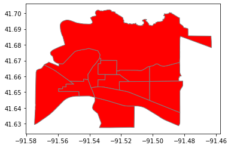  
Fig. 2  Iowa City with census tracts outlined in grey  

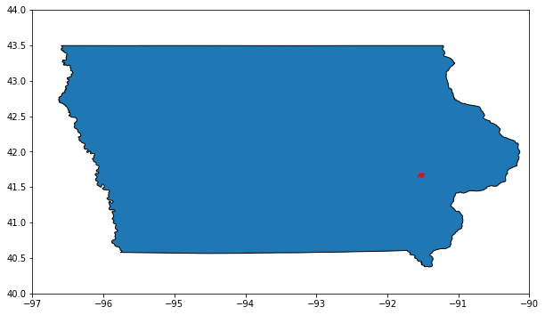  
Fig. 3  Iowa City in relation to the State of Iowa  

To get a perspective of the liquor business in Iowa City my analysis looked at broad markers, such as the adult population, number of liquor stores, total sales and persons to store ratio.  By looking at fig. 4 we can see that from 2012 to 2016 there is a general increasing trend in the population and total alcohol sales.  However there is a curious dip in population at year 2015 but rebounds in 2016.  One thing to mention is that the population count is estimated here versus the more accurate per decade census surveys.  Further investigation would be needed to see if this dip is real.   Looking at total liquor sales, there is a consistent upward trend between years 2013 to 2016.  The total sales in 2016 was $10,832,127, a 4.2% increase from the year before.  At the same time the number of stores has been increasing at one per year in the years 2014 to 2016.  To help put this in perspective, in 2016 for every store in Iowa City there were 660 people.  The trend has been decreasing since 2013 but the percent decreases have been fairly small, less than 1% between the years 2014 through 2016.  Overall the liquor business has been fairly consistent with no large swings in activity.  Not plotted in the chart below but stored in the data frame, the ratio of sales per store over the years 2014 through 2016 has been somewhat constant at $400,000 per store.  Based on generalities, unless population or drinking habits really picked up a new store would have to rely on taking customers away from existing stores.  As of 2016 there were 27 stores.  Their locations are plotting in fig. 5.  Of these stores in 2015 the highest sales for a given store was 4.15 million dollars.  The lowest was only $3694.  This shows there is quite a range between stores.  See fig. 6.  

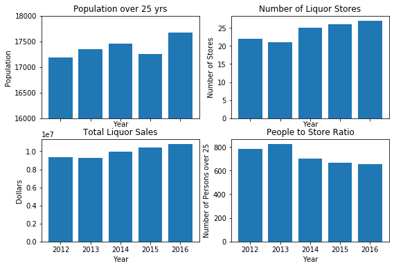  
Fig. 4 Iowa City general statistics by year, 2012-2016  

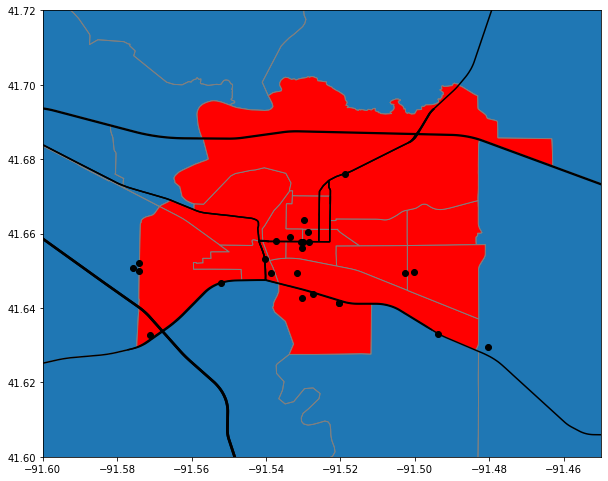  
Fig. 5 Liquor store locations as of 2016, Iowa City.  Black lines are major roads.  Grey outlines are census tracts.  

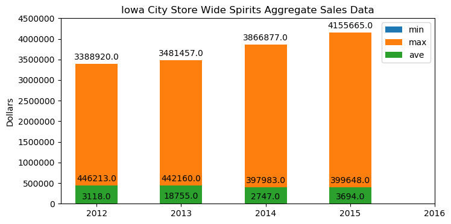  
Fig. 6  Maximum and minimum sales by a store in Iowa City  

The next phase of the analysis looked at individual stores.  Fig. 7 shows the sales breakdown of the top 10 stores.  Year 2016 was not included due to incomplete data.  Hy-vee Wine and Spirits had sales outnumbering all the other stores 4.15 million dollars.  This was about 5 times compared to its next competitor.  This seems unusual.  If we look closer there are other Hy-vee stores, as it is a grocery store chain.  It may be that most purchases from the Iowa alcohol commission are referenced to its main store and products are distributed to its other stores.  The database is not able to detect these differences as it does not tract which store actually sells the product to the final customer if a store chain is involved.  The stores in the top 10 sales were pretty constant over the years between 2012-2015.  Not included in the plot, the median sales in 2015 was 92,133 by a store called Kum and Go.  Twelve of the 24 stores in 2015 have sales less than $100,000.  Some of these stores are merely convenience stores and not full service liquor stores.  The sales in Iowa city are dominated by seven stores where sales are greater than $500,000.  So out of the 24 stores in Iowa City, I would only consider seven or so to equal competitors if opening a “true” liquor store.      

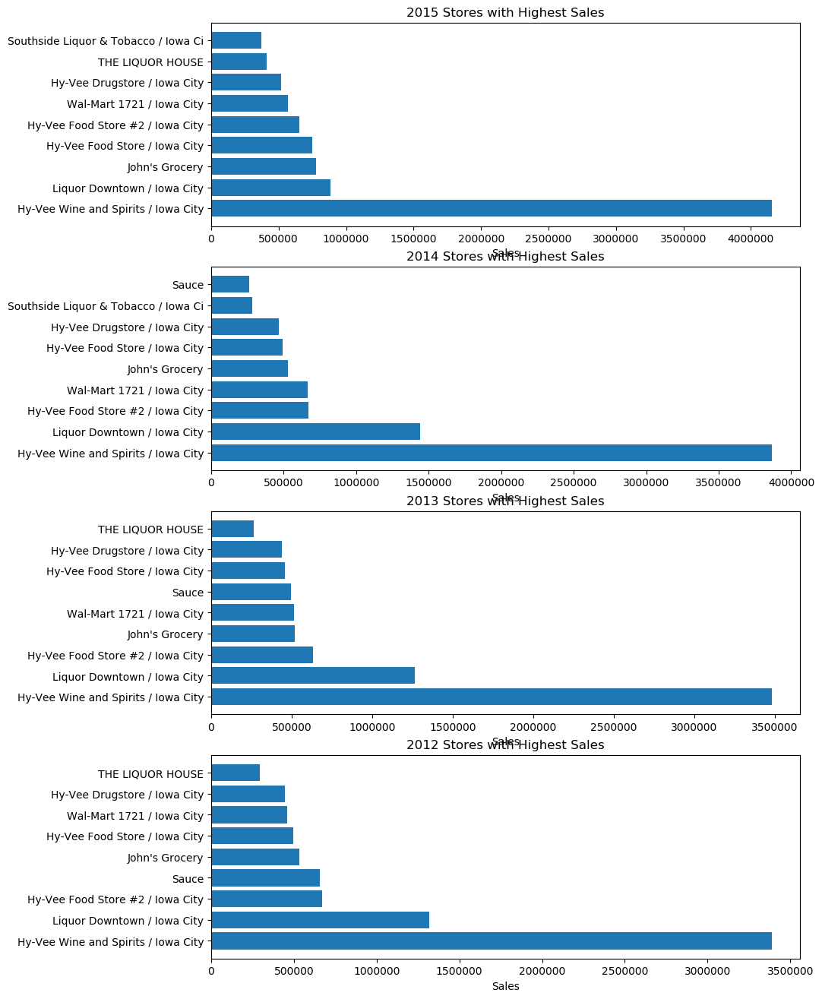  
Fig. 7  Sales by top 10 stores, years 2012-2015  

Another piece of vital information was to understand the population demographics of Iowa City.  For each store’s census tract location, I broke down employment data into separate categories and plotted them in a tree plot.  Not surprising, education is the biggest field of employment in this university town.  Hy-Vee Wine and Spirts’ neighborhood had education, entertainment, and manufacturing as the leading categories of employment.  Hy-Vee Wine and Spirits is also the store with highest sales so naturally this was one of interest.  Taking a look in the downtown neighborhood, education, entertainment and retail were the top employment categories.   

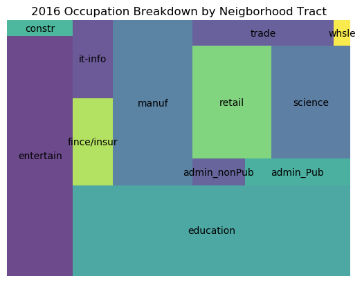  
Fig. 8  Employment categories – HyVee Wine and Spirits neighborhood  

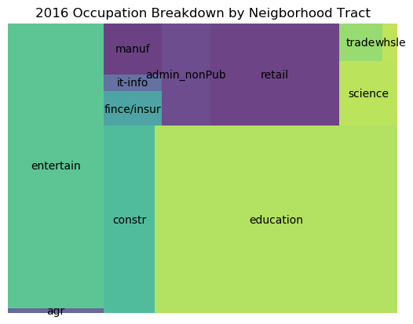  
Fig. 9  Employment categories – Liquor Downtown neighborhood  

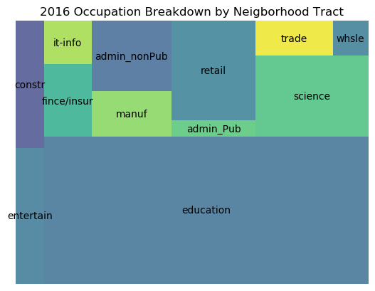  
Fig. 10  Employment categories – Walgreens neighborhood  

The last step in this process was to choose a suitable location.  The demographics of this small city did not seem to make a big difference in choosing a location.  Therefore, I decided to find a location next to a grocery store and offset at least 1/5 of a mile away from any liquor store.  This would automatically exclude any grocery stores which was also a liquor store.  This turned out to be a hard condition to meet.  Using PostgreSQL intersection query between grocery store and liquor store geographic data, there was only one grocery store which met this criteria.  This grocery store is called World Market and can be seen in Fig. 11.  The grocery stores are the yellow dots and the green dots are the liquor stores.  This will be the proposed location of the liquor store. Every other grocery store was already paired up with a liquor store nearby.  This is not surprising since if you’re out buying groceries you might as well stop in the liquor store too.  

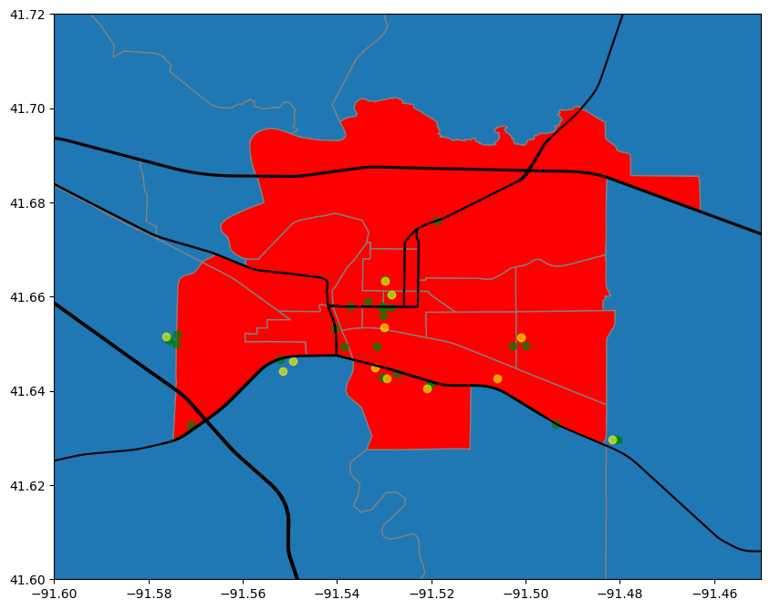  
Fig. 11 Liquor and Grocery store locations in Iowa City   
liquor store- green dot  
grocery store – yellow dot  

Conclusion:  
Having never set foot in Iowa City, the tools and public data bases used in this study has allowed me to have inside knowledge of the liquor store business in Iowa City.  I can now understand the challenges and potential of opening a liquor store here.  For example,  at first glance there seems to be a lot of liquor stores in this small city of 76,000, 24 in total.  However after analyzing the amount of sales of each store, there seems to be only seven full service stores, the rest being convenience type stores.  They are still competitors but to a lesser degree.  Without the public data base and tool base used in this study, these discoveries would be much more difficult to make.   Even though this analysis was performed for one city, the code can be generalized to easily adapt the analysis to another city.  For example the treemap is a function which takes in the store name and outputs the plot.  As long as the schemas follow the defined ER entity diagram much of the code can be adapted easily.  

